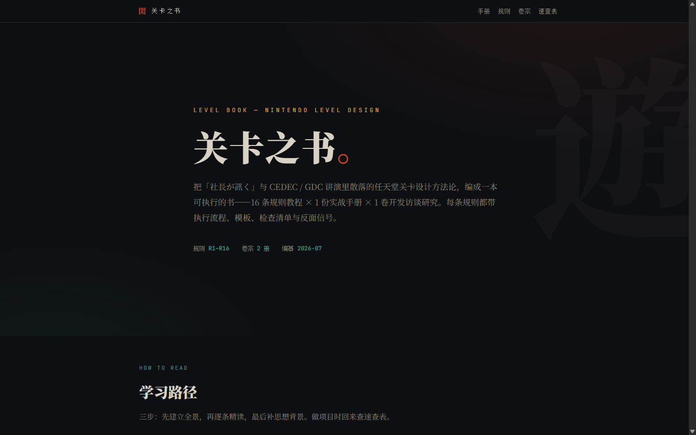
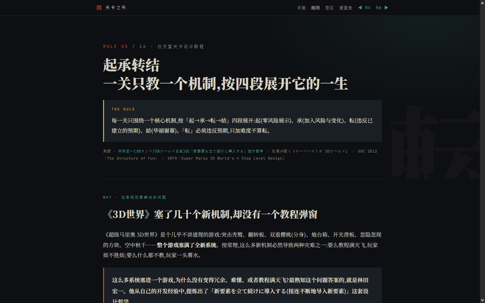
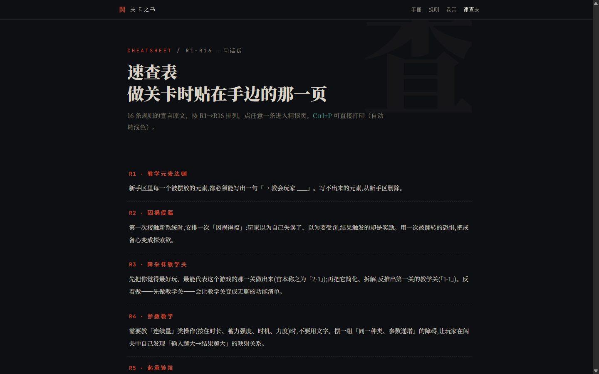

<div align="center">

# 関 关卡之书 · Level Book



> *「不是读物，是做关卡时摆在手边的工具书。」*

   

**给独立游戏开发者：把宫本茂、林田宏一、藤林秀麿在「社長が訊く」和 CEDEC / GDC 讲演里说过的关卡设计心法，编成 16 条带执行流程、模板、检查清单的规则——做关卡时直接照抄。**

<sub>16 条规则教程 × 1 份实战手册 × 1 卷开发访谈研究 · 每条规则一页 · 一句话宣言可打印速查</sub>

### ▶ [在线阅读 → shushuitie2017.github.io/game-book](https://shushuitie2017.github.io/game-book/)

[看效果](#-看效果) · [内容地图](#-内容地图) · [怎么读](#-怎么读) · [本地运行](#-本地运行) · [关于作者](#-关于作者)

</div>

---

## 📖 看效果

每条规则都是同一副骨架：**一句话宣言 → 任天堂的真实案例 → 执行流程 → 可抄的模板 → 检查清单 → 反面信号**。比如 R5「起承转结」：

<div align="center"></div>

**读完你带走的不是"任天堂好厉害"，而是一条今晚就能在自己关卡编辑器里执行的纪律。**

赶时间就直接开[速查表](https://shushuitie2017.github.io/game-book/cheatsheet.html)——16 条宣言一页排完，Ctrl+P 自动转浅色打印，贴在工位旁：

<div align="center"></div>

## 🗺 内容地图

| 分部 | 规则 | 一句话主题 |
|------|------|-----------|
| 第一部 · 教学 | [R1](https://shushuitie2017.github.io/game-book/R01-teaching-elements.html)–[R4](https://shushuitie2017.github.io/game-book/R04-parameter-teaching.html) | 不用文字教会玩家：教学元素法则 / 因祸得福 / 降采样教学关 / 参数教学 |
| 第二部 · 结构 | [R5](https://shushuitie2017.github.io/game-book/R05-kishotenketsu.html)–[R6](https://shushuitie2017.github.io/game-book/R06-finale-flourish.html) | 一个机制的一生：起承转结 / 炫技谢幕 |
| 第三部 · 引导 | [R7](https://shushuitie2017.github.io/game-book/R07-gravity-design.html)–[R11](https://shushuitie2017.github.io/game-book/R11-triangle-ratio.html) | 让玩家自己想去：引力设计 / 周期引力 / 形状与情绪 / 顶点聚光灯 / 三角配比 |
| 第四部 · 流程 | [R12](https://shushuitie2017.github.io/game-book/R12-kyoto-calibration.html)–[R16](https://shushuitie2017.github.io/game-book/R16-anti-busywork.html) | 先确定好玩再确定规模：京都标定法 / 空场地先行 / 热力图验证 / 反馈免跟进 / 拒绝填空式自欺 |

外加两册长卷宗：🔥 [实战手册](https://shushuitie2017.github.io/game-book/manual.html)（7 章总纲：马里奥 1-1 逐格教学配置 → 热力图验证闭环）和 [开发访谈研究卷宗](https://shushuitie2017.github.io/game-book/dossier.html)（岩田聪的瓶颈论、宫本茂的点子观、旷野之息的乘法设计）。

## 📚 怎么读

1. **通读[实战手册](https://shushuitie2017.github.io/game-book/manual.html)**——约 40 分钟建立全景；
2. **逐条精读 16 规则**——边做项目边查，站内搜索直达任意章节，读过的卡片自动打勾（本地 localStorage，无账号无上报）；
3. **翻[访谈卷宗](https://shushuitie2017.github.io/game-book/dossier.html)**——弄清每条规则背后的思想从哪来。

## 🛠 本地运行

```bash
git clone https://github.com/shushuitie2017/game-book.git
cd game-book
python build_site.py
python -m http.server 5031 -d out    # 打开 http://localhost:5031/
```

<details>
<summary>工程细节（点开）</summary>

- **零框架、零 npm、零第三方运行时**（Google Fonts 除外）：构建器是一个约 200 行的纯 Python 标准库脚本，读 `data/rules.json` + `src/content/`（18 篇内容页真相源），注入导航 / SEO / 搜索索引后产出 `out/`。
- 20 页全站零死链（`tools/check_links.py` 守门），首页 Lighthouse 四项全 100。
- 部署即推送：push main 后 GitHub Actions 自动跑 `build_site.py` 发布 Pages，构建产物不入库。
- 换域名只改 `data/rules.json` 的 `site.base` 重推一次。

</details>

## ⚖ 诚实边界

- **本项目与任天堂没有任何关联**，不是官方资料。内容整理自公开访谈（社長が訊く、開発者に訊きました）与公开讲演（GDC、CEDEC）的媒体报道，属二手转述；图示为示意复原，不含任何官方素材。
- 引文为最小限度摘录，每页脚注均列明报道来源。
- 目前仅中文，无英日文正文。

## 📕 背后的故事

英文圈早有成体系的关卡设计知识库（The Level Design Book、World of Level Design），中文圈却只有散落在论坛与专栏里的零星长文——没有一本"编号、可执行、带检查清单"的书。于是把任天堂三十年访谈与讲演里反复出现的方法提炼成 16 条规则，起名**关卡之书**：书是用来翻的，规则是用来抄的。

## 👤 关于作者

**蓝猫 BlueCat** —— AI-native builder，用 Claude 造小而完整的东西：游戏、工具、知识库。

| 渠道 | 地址 |
|------|------|
| GitHub | [@shushuitie2017](https://github.com/shushuitie2017) |
| 微信 | 扫码加好友 ↓ |


### 也在做

| 项目 | 一句话 |
|------|--------|
| [Three.js Skills](https://threejsskills.bluecatbot.com/) | 9 个 Three.js 游戏开发 skill + 总监编排，中文游戏技能包 |
| [GameBox](https://gamebox.bluecatbot.com/) | 74 个浏览器 3D 游戏积木模块，5 个实时 demo |
| [HardwareLab](https://hardware.bluecatbot.com/) | 3D 硬件拆解教学：6 件硬件 66 个部件，爆炸视图 + 16 段动画 |

## 许可证

**MIT —— 随便用，随便改，随便造。**

---

<div align="center">

*「不是读物，是做关卡时摆在手边的工具书。」*

**📖 [shushuitie2017.github.io/game-book](https://shushuitie2017.github.io/game-book/)**

</div>

## English

**Level Book** distills Nintendo's level-design methodology—from Iwata Asks interviews and GDC / CEDEC talks—into **16 executable rules** (each with a one-line doctrine, real Nintendo case studies, step-by-step workflow, copyable templates, and a checklist), plus a 7-chapter field manual and a developer-interview dossier. Chinese only for now. [Read online →](https://shushuitie2017.github.io/game-book/)
